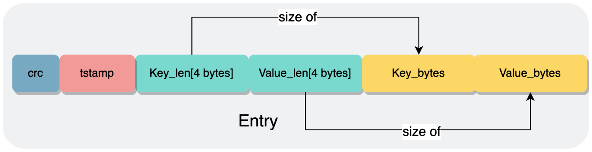

## Info
基于日志的，即Log-Structured,采用顺序写入的方式，无论是删除还是更新都是向日志文件当中追加一个Entry，利用磁盘顺序写入的性能大于随机写入的特点，以达到高的写入性能性能.
但是同样的，在存储空间上会做出牺牲(日志文件当中会存储一些无效、过时的Entry).

* [bitcask-intro Paper 理论指导](https://riak.com/assets/bitcask-intro.pdf) 

* [散列索引](http://ddia.vonng.com/#/ch3?id=%e6%95%a3%e5%88%97%e7%b4%a2%e5%bc%95) 

## Architecture
在数据管理上分为两部分，分别是内存（keydir）和磁盘（log）.

* 在内存当中维护一个 BTreeMap，key为存储的key，而value为Entry的metadata，记录长度和位置，用于进行偏移读取。map当中始终保存当前key的最新版本的位置
* 磁盘上使用Log-Structured进行管理，任何操作都是写入一个Entry，追加到日志文件的末尾，Log当中的存储单元通常为Entry。Entry的结构如下图1, 没有实现crc和timestamp。

 图1

## Interface
### Get
首先查询内存(keydir)当中的map，如果不存在那么就是真的不存在， 返回None。如果能查询到，那么就根据metadata去磁盘(log)当中读取出对应的value。

### Set
首先向磁盘(log)当中写入一条新的Entry，如果并且更新内存(keydir)的map，保存新Entry的offset

### Del
和 Set 的逻辑基本一致，只不过value的类型不一样，写入的内容为tombstone，标志val已经被删除，同时删除内存当中的kv。

### flush
将磁盘数据及时持久化。

### scan、 scan_prefix
借助内存存储结构的特性，从前缀开始迭代所有键/值对。

### status
统计当前内存和磁盘的使用信息并返回

## Compact
在写入过程当中，会有key被更新或者删除，但是旧版本的key依旧会存在于日志文件当中，随着时间的增加，日志文件当中的无效数据就会越来越多，占用额外的存储空间。因此就需要compaction将其清除。 
对比LSM-Tree来说，Logcask的Compaction非常简单，只需要遍历当前内存当中存在的key，读取旧文件，写入到新文件当中，之后删除旧文件保存新文件。

但是该设计目前仅是存储布局模型中的一种实现，后续会通过只读小文件组成mainfest清单的形式提供存储能力，compaction 进行有限的小文件合并。

